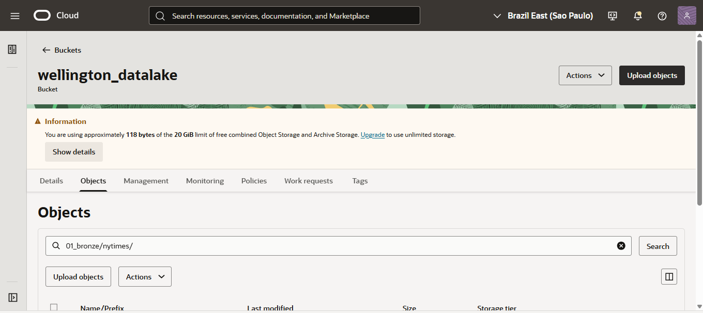
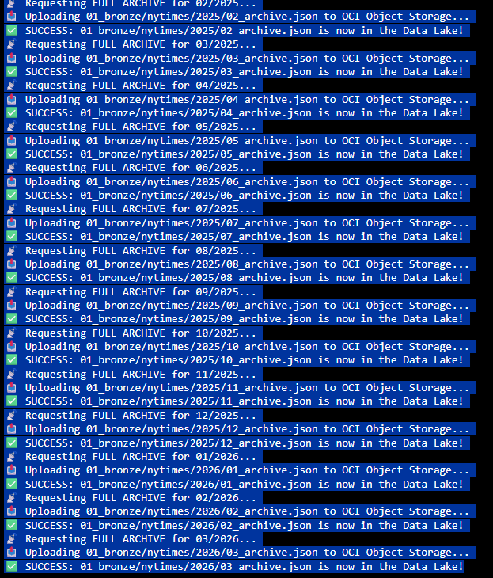

# 📰 NYT Data Lakehouse: Automated ETL Pipeline with OCI
### *Modern Data Engineering | Medallion Architecture | Oracle Cloud Infrastructure*

## 📌 Project Overview
This MVP (Minimum Viable Product) demonstrates a full **End-to-End Data Pipeline** using the **New York Times Archive API**. The goal is to ingest, transform, and analyze over 7 years of global news data (2019–2026) using **Oracle Cloud Infrastructure (OCI)** and a **Medallion Architecture**.

I developed this project to showcase how **Object Storage** and **Autonomous Data Warehouse (ADW)** can be integrated into a high-performance **Lakehouse** using Python and SQL.

---

## 🛠 Technical Architecture (Medallion)
The data flows through three distinct stages to ensure quality and performance:

1.  **🥉 Bronze Layer (Raw):** * **Source:** NYT Archive API.
    * **Process:** Python script fetches full monthly archives (~20MB/month).
    * **Storage:** Raw JSON files stored in OCI Object Storage via **Pre-Authenticated Requests (PAR)**.
2.  **🥈 Silver Layer (Cleaned):** * **Process:** Batch processing using **Pandas**. 
    * **Transformation:** Filtering specific columns (`headline`, `pub_date`, `section`), handling missing values, and data type conversion.
    * **Storage:** Optimized **Apache Parquet** files for high-speed querying.
3.  **🥇 Gold Layer (Analytics):** * **Process:** **Oracle DBMS_CLOUD** integration.
    * **Outcome:** External Tables in **Autonomous Database** enabling SQL analytics and Business Intelligence.

---

## 🚀 Key Features
* **Historical Depth:** Ingests thousands of articles per month from 2019 to 2026.
* **Cloud-Native Security:** Uses **OCI PARs** for secure API-to-Cloud communication without hardcoded credentials.
* **Cost Efficiency:** Built entirely on the **OCI Free Tier**, utilizing high-compression Parquet files to minimize storage footprint.
* **Schema-on-Read:** Implements a Data Lakehouse approach where the database queries files directly in Object Storage.

---

## 📂 Repository Structure
* `/images`: Images from Data Sources, Architecture diagrams from NYT API and Creation on OCI.
* `/python`: Pandas to acess NYT API scripts for JSON-to-Parquet and search for News

---

## 💡 How to Run
1.  **API Key:** Obtain your key at the [NYT Developer Portal](https://developer.nytimes.com/).
2.  **OCI Setup:** Create a bucket and a PAR URL.
3.  **Run Ingestor:** Execute first part of python file to populate the Bronze layer.
4.  **Run Processor:** Execute second part of python file to generate Parquet files.

---

## 🏆 Oracle ACE Apprentice Milestone
This project highlights my expertise in **OCI Architecture** and **Data Engineering**. It proves that I can handle large-scale data ingestion and transformation using industry-standard tools and Oracle’s best-in-class cloud database services.

---
*Developed by Wellington - Computer Engineering Student & Oracle ACE Apprentice*
