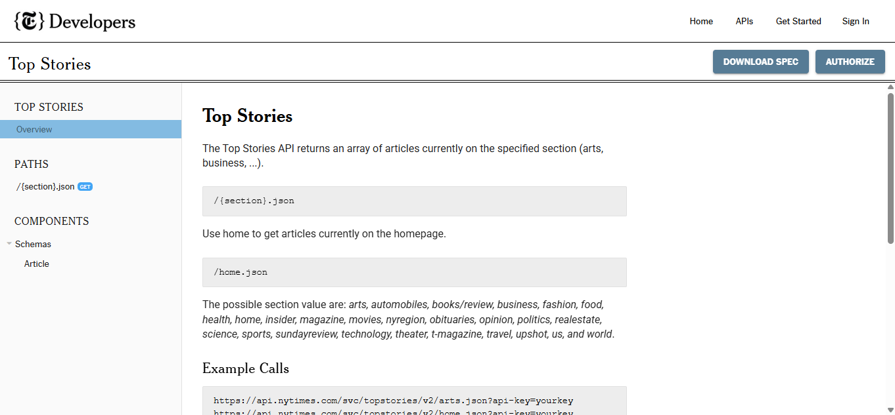
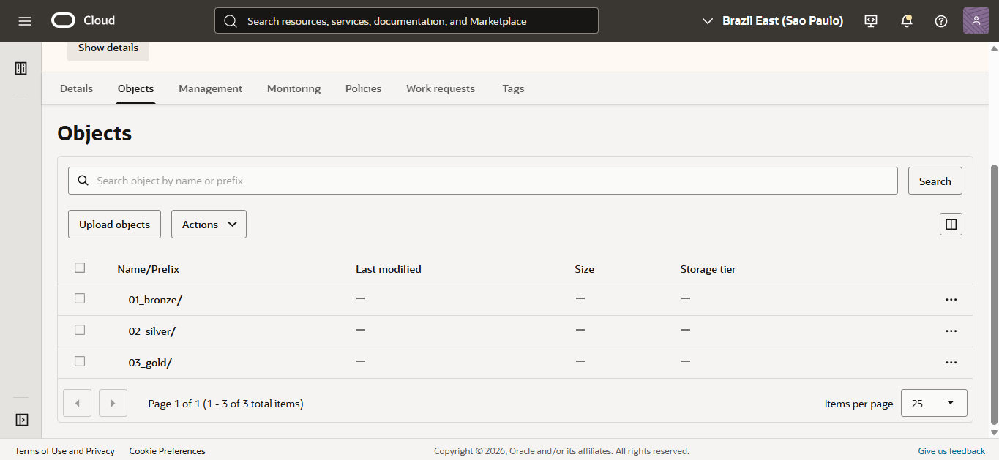
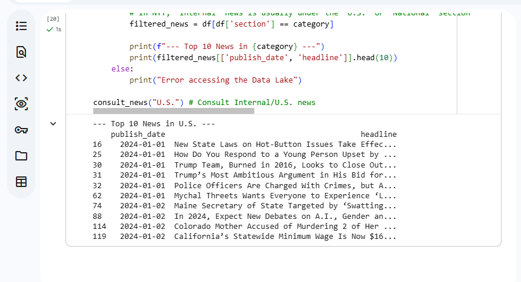

# 📰 NYT Data Lakehouse: Automated ETL Pipeline
**Modern Data Engineering | Medallion Architecture | Oracle Cloud Infrastructure**

## 📌 Project Overview
This project implements a scalable **Data Lakehouse** using the New York Times Archive API. It demonstrates a complete end-to-end pipeline, ingesting over 7 years of global news data (2019–2026) into **Oracle Cloud Infrastructure (OCI)**. 

By leveraging the **Medallion Architecture**, I’ve ensured that raw data is transformed into high-value business intelligence through a structured validation process.

---

## 🏗 System Architecture
The data flows through a cloud-native pipeline designed for security and cost-efficiency:

### 🥉 Bronze Layer (Raw)
* **Source:** NYT Archive API.
* **Ingestion:** Python scripts fetch monthly JSON archives.
* **Storage:** **OCI Object Storage** using Pre-Authenticated Requests (PAR) to eliminate hardcoded credentials in the code.

* NYT Developer Portal:

  **

### 🥈 Silver Layer (Cleaned)
* **Processing:** Batch processing with **Pandas**.
* **Transformation:** Column filtering (`headline`, `pub_date`, `section`), deduplication, and handling of null values.
* **Storage:** **Apache Parquet** format for optimized storage and schema-on-read performance.
*  *OCI Bucket Structure & Bronze/Silver/Gold Folder Prefixing.*
*  
  

### 🥇 Gold Layer (Analytics)
* **Integration:** **Oracle DBMS_CLOUD** package.
* **Outcome:** External Tables in an **Autonomous Data Warehouse (ADW)**, enabling complex SQL analytics without moving the data out of Object Storage.
*Python Terminal Querying the Data Lake: 
**
:

---

## 🚀 Engineering Highlights
* **Security First:** Utilized **OCI PARs** for secure API-to-Cloud communication, adhering to the principle of least privilege.
* **Schema-on-Read:** Implemented a true Lakehouse approach where the database queries Parquet files directly in Object Storage, reducing storage costs.
* **Scalability:** Designed to handle thousands of articles per month with a focus on data type conversion and 2-decimal precision for any numerical metrics.
* **Oracle ACE Apprentice Standards:** Built entirely on the OCI Free Tier, demonstrating high-performance engineering within resource constraints.

---

## 📂 Repository Structure
* `/python`: Python scripts for API ingestion and Parquet conversion.
* `/images`: Diagrams and API documentation.

---

## 🏆 About the Author
**Wellington Lacerda**
*Computer Engineering Student @ UNIVESP | Oracle ACE Apprentice*
Specializing in Cloud Architecture, Data Engineering, and IoT.
